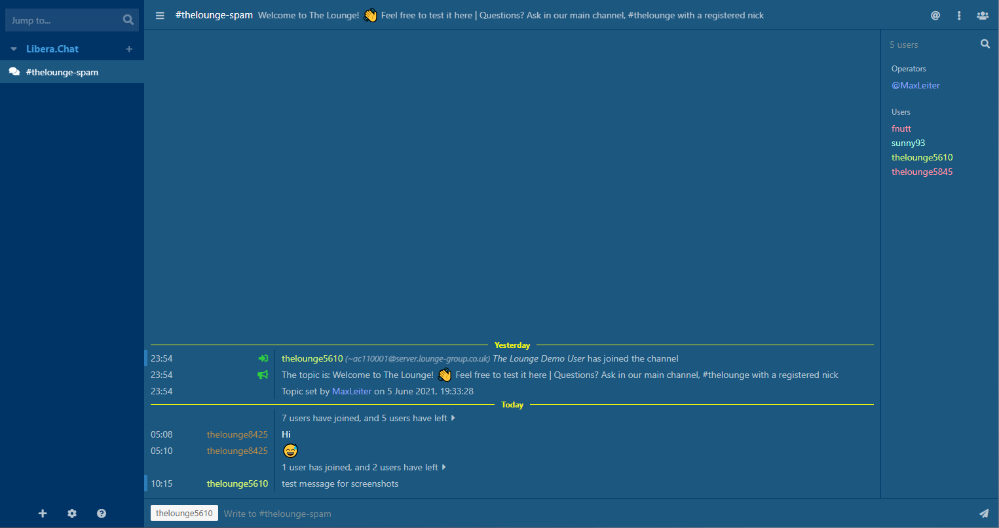

<h1 align="center">
	OcUK Blue theme for The Lounge Chat
</h1>

<h3 align="center">
	A simple theme with blue colours
</h3>

<p align="center">
	<a href="https://demo.thelounge.chat/"></a>
	<a href="https://www.npmjs.com/package/thelounge-theme-ocuk-blue"></a>
	<a href="https://npm-stat.com/charts.html?package=thelounge-theme-ocuk-blue"></a>
</p>

<p align="center">
	
</p>

<p align="center">
<a href="https://www.buymeacoffee.com/zen262176" target="_blank"></a>
</p>

## Installation :sparkles: (https://bit.ly/3i9eMEb)
Install this theme with npm:

```sh
thelounge install thelounge-theme-ocuk-blue
```

## Issues :sparkles:  
If you have an issue, change request or comments about this theme please report it below:<br/>
<a href="https://github.com/el-profesor926/thelounge-theme-ocuk-blue/issues">/thelounge-theme-ocuk-blue/issues</a>
